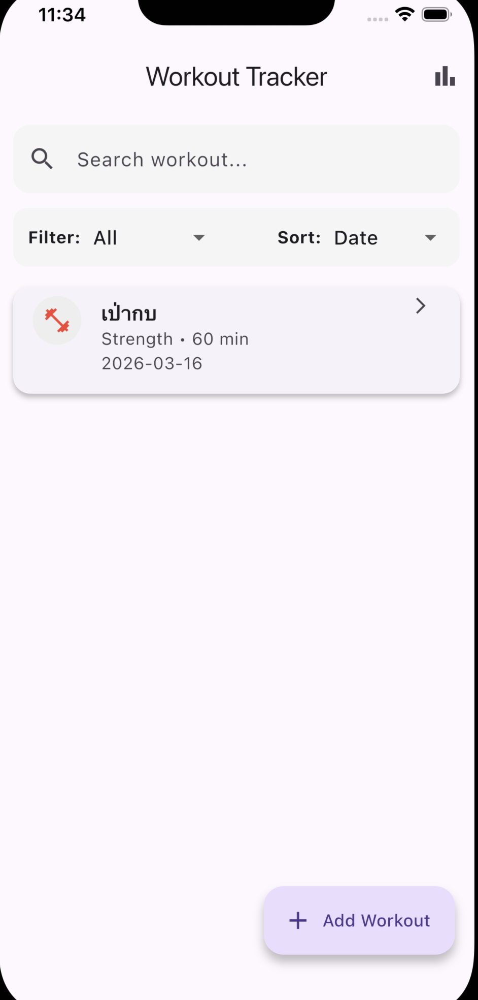
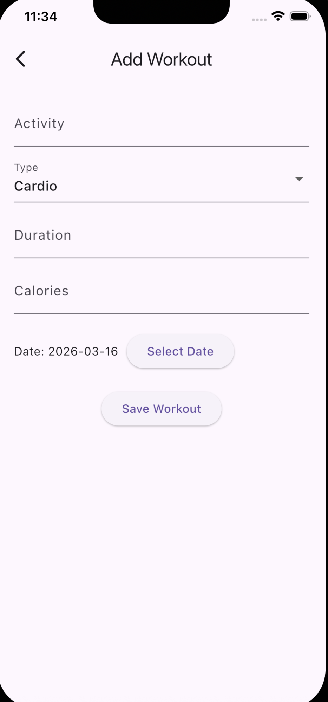
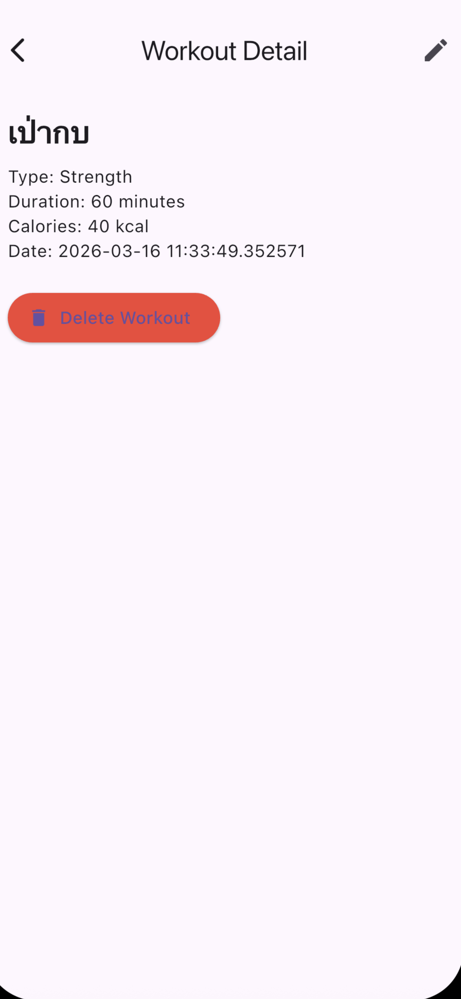
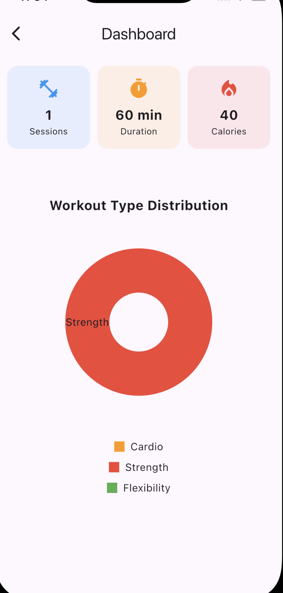

# Workout Tracker App

## ชื่อผู้จัดทำ

บวรรัตน์ ศิริเมือง

## ชื่อโปรเจกต์

Workout Tracker Application

## Package Name

com.borwonrat.workouttracker

---

# รายละเอียดแอปพลิเคชัน

Workout Tracker เป็นแอปพลิเคชันสำหรับบันทึกกิจกรรมการออกกำลังกาย ผู้ใช้สามารถเพิ่ม แก้ไข ลบ และค้นหาข้อมูลการออกกำลังกายได้ รวมถึงสามารถดูสรุปข้อมูลผ่านหน้า Dashboard

แอปถูกพัฒนาด้วย Flutter และใช้ Provider สำหรับจัดการ State พร้อมใช้ SQLite สำหรับจัดเก็บข้อมูลภายในเครื่อง

---

# ฟีเจอร์หลักของแอป

### 1. แสดงรายการข้อมูล

แสดงรายการกิจกรรมการออกกำลังกายทั้งหมดที่ผู้ใช้บันทึกไว้

### 2. เพิ่มข้อมูลการออกกำลังกาย

ผู้ใช้สามารถเพิ่มกิจกรรมใหม่ โดยระบุข้อมูลดังนี้

* ชื่อกิจกรรม
* ประเภทการออกกำลังกาย
* ระยะเวลา
* วันที่
* แคลอรี

### 3. แก้ไขข้อมูล

ผู้ใช้สามารถแก้ไขข้อมูลกิจกรรมที่บันทึกไว้ได้

### 4. ลบข้อมูล

ผู้ใช้สามารถลบข้อมูลได้โดย

* เลื่อนรายการ (Swipe to delete)
* กดลบจากหน้ารายละเอียด

### 5. ค้นหาข้อมูล

ผู้ใช้สามารถค้นหากิจกรรมจากชื่อกิจกรรม

### 6. กรองข้อมูล

สามารถกรองข้อมูลตามประเภทการออกกำลังกาย เช่น

* Cardio
* Strength
* Flexibility

### 7. Dashboard

แสดงสรุปข้อมูลการออกกำลังกาย เช่น

* จำนวนครั้งการออกกำลังกายทั้งหมด
* ระยะเวลาการออกกำลังกายรวม
* แคลอรีรวมที่เผาผลาญ

พร้อมแสดงกราฟสถิติ

---

# เทคโนโลยีที่ใช้

* Flutter
* Provider (State Management)
* SQLite (Local Database)
* fl_chart (แสดงกราฟ)

---

## 📁 Project Structure

```
lib/
│
├── models/
│   └── workout.dart
│
├── providers/
│   └── workout_provider.dart
│
├── services/
│   └── database_service.dart
│
├── screens/
│   ├── home_screen.dart
│   ├── add_workout_screen.dart
│   ├── edit_workout_screen.dart
│   ├── detail_screen.dart
│   └── dashboard_screen.dart
│
└── widgets/
    └── workout_card.dart
```

---

# โครงสร้างฐานข้อมูล

ตารางที่ 1: workout_types

| id | name        |
| -- | ----------- |
| 1  | Cardio      |
| 2  | Strength    |
| 3  | Flexibility |

ตารางที่ 2: workouts

| id | activity | type | duration | calories | date |

---


# ภาพหน้าจอแอป

## Home Screen



## Add Workout



## Detail Screen



## Dashboard



---

# วิธีรันโปรเจกต์

1. Clone repository

git clone https://github.com/BorwonratSE/Mobile-App-ENGSE608.git

2. เข้าโฟลเดอร์โปรเจกต์

cd Final

3. ติดตั้ง dependencies

flutter pub get

4. รันแอป

flutter run

---

# Demo

สามารถดูการทำงานของแอปได้จากไฟล์ APK
